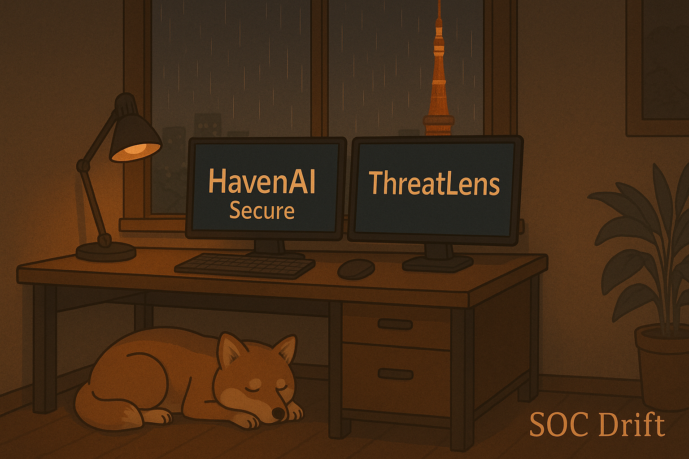

# SOC Drift – Lo-fi for Threat Analysts

_A cozy ambient loop crafted for late-night cybersecurity work._

## 🎧 Listen

This audio loop was designed for threat analysts, SOC teams, and night owls building secure systems after hours. 

> Currently updating the final MP3. Stay tuned.

<!-- To add the working MP3 once available, use this:
[Download the SOC Drift Loop (MP3)](./soc-drift-loop.mp3)
-->

## 🛠️ Project Credits

- **Visuals:** Hand-crafted lo-fi scene featuring HavenAI Secure & ThreatLens  
- **Concept:** Original ambient loop for focus, built from Teshera’s workflow  
- **Art Direction:** Late-night SOC, Shiba Inu companion, Tokyo Tower in the rain  

## 👋 About the Creator

Hi, I’m Teshera — a Security Technologist & Builder focused on ethical AI, privacy-first systems, and automation. You can learn more or connect via [tesherakimbrough.dev](https://tesherakimbrough.dev)

---

_This project is part of my public portfolio showcasing thoughtful security tools with creative energy. If it resonates, star the repo or reach out._
